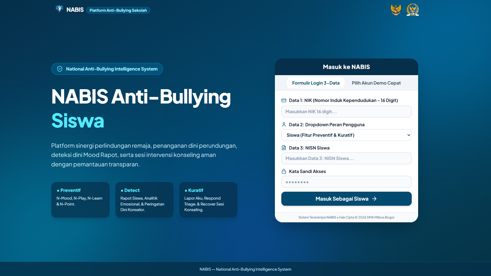

# 🛡️ NABIS (National Anti-Bullying Intelligence System)



**NABIS** adalah platform sinergi perlindungan remaja, penanganan dini perundungan, deteksi dini Mood Rapot, serta sesi intervensi konseling aman dengan pemantauan yang transparan di lingkungan sekolah. 

Proyek ini dibangun untuk memberikan ruang aman bagi siswa, sekaligus memberikan alat pantau yang komprehensif bagi Guru BK, Orang Tua, dan pemangku kepentingan lainnya.

---

## Fitur Utama

Sistem ini membagi pendekatannya menjadi tiga pilar utama:

### 1. Preventif (Pencegahan)
Fokus pada kesejahteraan mental siswa sehari-hari.
*   **Daily Mood Check:** Pemantauan kondisi emosional siswa setiap hari.
*   **Knowledge Check & Games:** Modul edukasi dan permainan interaktif tentang *anti-bullying*.
*   **Reward & Punishment:** Sistem gamifikasi untuk mendorong perilaku positif di lingkungan sekolah.

### 2. Detect (Deteksi Dini)
Alat analitik untuk konselor dan guru.
*   **Rapot Siswa:** Rekapitulasi perkembangan akademik dan perilaku.
*   **Analitik Emosional:** Pemetaan tren *mood* siswa berdasarkan data harian.
*   **Peringatan Dini Konselor:** Notifikasi otomatis jika terdeteksi indikasi masalah emosional atau perundungan.

### 3. Kuratif (Penanganan)
Sistem pelaporan dan pemulihan.
*   **N-Report:** Saluran pelaporan insiden perundungan yang aman.
*   **Respond Triage:** Sistem klasifikasi prioritas penanganan laporan.
*   **Recover (Sesi Konseling):** Fasilitas intervensi dan penjadwalan konseling yang terenkripsi dan transparan.

---

## Sistem Autentikasi (3-Data Login)

Sistem login NABIS dirancang dengan keamanan berlapis untuk membedakan hak akses masing-masing peran, membutuhkan:
1.  **NIK** (Nomor Induk Kependudukan - 16 Digit)
2.  **Peran Pengguna** (Siswa, Guru BK, Orang Tua, TP2K, Pemerintah)
3.  **ID Unik** (NISN untuk Siswa, NIP untuk Guru BK)

---

## Tech Stack

Aplikasi ini dikembangkan menggunakan teknologi *frontend* modern:
*   **Framework:** React (Vite)
*   **Styling:** Tailwind CSS (Tema *Sea Blue*)
*   **Icons:** Lucide-React (Google Material Icons)
*   **Deployment:** Vercel

---

## Cara Menjalankan Proyek secara Lokal

Jika Anda ingin menjalankan atau mengembangkan proyek ini di komputer lokal, ikuti langkah-langkah berikut:

1. Kloning *repository* ini:
   ```bash
   git clone [https://github.com/Shafw00n/nabis.git](https://github.com/Shafw00n/nabis.git)
